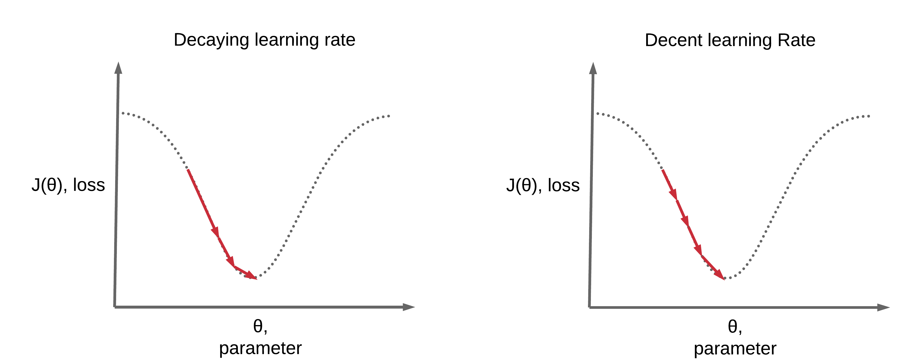
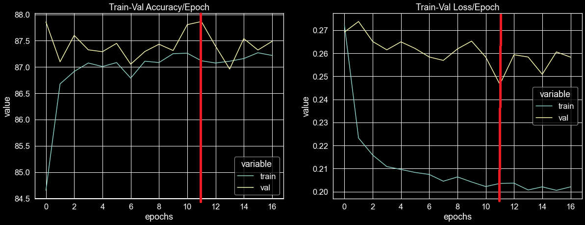

# Different types of neural network regularization techniques in pytorch

Este repo lo haré con el objetivo de tener implementado, varios métodos de regularización, en la construcción de redes neuronales en pytorch. Durante mucho tiempo, mi excusa para usar tensorflow y no pasarme a los grafos dinámicos era que las técnicas de regularización de pytorch eran re manuales, no existián y me daba flojera tener que hacerlas, en particular los learning rate schedulers y el early stopping, cuando lo quería prototipar rápido algo [un prototipado que se pasaba a productivo] y sacarme el cacho de programar regularizadores, este repo lo hago porque la excusa es bastante mala y es tiempo a empezar a asumir que pytorch ha crecido caleta y es momento de ponerse al día.


<p align="center">
  
</p>


Voy a tener un ejemplo de:


* LR scheduler --> torch.optim.lr_scheduler o en src/lr_scheduler.py
* Early stopping --> src/early_stopping.py
* Dropout --> torch.nn dropout 
* Batchnormalization --> torch.nn BatchNorm1d
* L1 regularization, L2 Regularization y Weight decay
* Data Augmentation [un pequeño parrafo, no es el interes de este repo]

Esto para hacerme más fácil la pega al hora de entrenar
redes en pytorch. Haciendo más modulor mi código !

# Contexto:

Voy a usar data publica de un desafío de kaggle de clasificación de galaxias para hacer las pruebas y construir en src/ una serie de módulos que me hagan rapido
el entrenamiento de redes en pytorch, teniendo en cuenta su regularización:


* https://data.galaxyzoo.org/  [tabla 2]


En kaggle, hay varias implementaciones en keras y tensorflow, pero ninguna en pytorch, llegan a una accuracy de 85 % en la data tabular.


* https://www.kaggle.com/c/galaxy-zoo-the-galaxy-challenge/code


Las redes las tendré acá

```zh
codes/galaxies/nn_galaxies.py
codes/galaxies/cnn_galaxies.py
codes/time-series/lstm.py
```


# Preprocessing


Con el fin de no llegar y usar la data, agrego un poco de características, pasando por polynomial features, exponential y log features, reduzco la cantidad de características por correlación pearson y me quedó con por ejemplo, si dos columans tienen alta correlación, me quedo con una sola columna y boto la otra. Con esto de originalmente 7 features quedo en 20 features y 3 targets [el one-hot-encoder] de las 3 clases de galaxias que hay. Finalmente antes de entrenar estandarizo en vez de normalizar, dado los features polinomiales que metí (si no pierde sentido hacer lo otro). Esto es entregado, a redes neuronales, para probar distintas técnicas de regularización.

```zh
codes/galaxies/preprocessing_galaxies.py

```


## Optimizer

Antes de empezar, con los regularizadores de la red, analytics in diamag saco hace re poco [enero 2021] un super buen post sobre los optimizadores implementados en pytorch


Yo últimamente me he decaído por el Adamax, me ha resultado bastante bueno comparado con el que siempre usaba que era Adam (adptative momentum) o Nadam (nesterov adptative momentum), pero esto es cuestión de prueba y error nomás, ocupar el que te guste más nomás.


<p align="center">
  
</p>


<p align="center">
  
</p>


* https://analyticsindiamag.com/ultimate-guide-to-pytorch-optimizers/


# LR Scheduler 

Mientras entranas redes neuronales muy grandes/profundas, estás tienen más facilidad de sobreajustarse. Esto se convierte en un problema durisimo cuando el conjunto de datos es pequeño y simple. podemos saber esto fácilmente cuando, durante el entrenamiento, la pérdida de validación y la pérdida de entrenamiento comienzan a divergir gradualmente (curva de validación sube, entrenamiento sigue bajando).

Esto significa que el modelo está empezando a sobreajustarse (memorizarse los datos). Además, el uso de una tasa de aprendizaje única y de alto valor puede hacer que el modelo pierda por completo los óptimos locales durante las últimas fases del entrenamiento. Durante las últimas fases, los parámetros deben actualizarse gradualmente, a diferencia de las fases iniciales de entrenamiento.


Entrenar una red neuronal grande mientras se usa una única tasa de aprendizaje estática es realmente peluo [los entrenamientos tiender a ser extramadamente ruidosos]. Aquí es donde ayuda tener un scheduler de tasas de aprendizaje, donde podemos disminuir gradualmente el valor de la tasa de aprendizaje de forma dinámica durante el entrenamiento, cumpliendo el criterio de ciertas condiciones. Hay muchas maneras de hacer esto torch.optim.lr_scheduler tiene muchas. Pero el método más utilizado es cuando la pérdida de validación no mejora durante algunas épocas, lo que se llama el ReduceLrOnPlateu.


Digamos que observamos que la pérdida de validación no ha disminuido durante **alpha** épocas consecutivas. Entonces hay una gran probabilidad de que el modelo comience a estancarse y no avanzar hacía otros mínimos. En ese caso, podemos comenzar a disminuir la tasa de aprendizaje, digamos, en un factor de **teta**. Podemos continuar con esto durante un cierto número de épocas. Cuando estamos seguros de que la tasa de aprendizaje es tan baja que el modelo no aprenderá nada, entonces podemos detener el entrenamiento. Esto es clasiquisimo en problemas de optimización, estás llegando al minimo, muevete mas lento para no alejarte de esa zona (suena raro pero es asi XD, como la vida misma diria un amigo). 


<p align="center">
  
</p>


<p align="center">
  
</p>


Pytorch esto lo tiene bastante avanzado, donde tiene implementado los distintos reductores de tasa de aprendize en su modulo de:

**--> torch.optim.lr_scheduler:**


Acá todos los schedulers implementados a la fecha en pytorch

* torch.optim.lr_scheduler.LambdaLR(optimizer, lr_lambda, last_epoch=-1, verbose=True)
* torch.optim.lr_scheduler.MultiplicativeLR(optimizer, lr_lambda, last_epoch=-1, verbose=True)
* torch.optim.lr_scheduler.StepLR(optimizer, step_size, gamma=0.1, last_epoch=-1, verbose=True)
* torch.optim.lr_scheduler.ExponentialLR(optimizer, gamma, last_epoch=-1, verbose=False)
* torch.optim.lr_scheduler.CosineAnnealingLR(optimizer, T_max, eta_min=0, last_epoch=-1, verbose=False)
* torch.optim.lr_scheduler.ReduceLROnPlateau(optimizer, mode='min', factor=0.1, patience=10,
                                             threshold=0.0001, threshold_mode='rel',
                                             cooldown=0, min_lr=0, eps=1e-08,
                                             verbose=True)
* torch.optim.lr_scheduler.CyclicLR(optimizer, base_lr, max_lr, step_size_up=2000, step_size_down=None,
                                    mode='triangular', gamma=1.0, scale_fn=None, scale_mode='cycle',
                                    cycle_momentum=True, base_momentum=0.8, max_momentum=0.9, last_epoch=-1, verbose=False)
* torch.optim.lr_scheduler.OneCycleLR(optimizer, max_lr, total_steps=None, epochs=None, steps_per_epoch=None,
                                      pct_start=0.3, anneal_strategy='cos', cycle_momentum=True,
                                      base_momentum=0.85, max_momentum=0.95, div_factor=25.0,
                                      final_div_factor=10000.0, three_phase=False,
                                      last_epoch=-1, verbose=False)
* torch.optim.lr_scheduler.CosineAnnealingWarmRestarts(optimizer, T_0, T_mult=1, eta_min=0, last_epoch=-1,
                                                       verbose=False)


Según [7] la útilización de schedulers ciclicos permité una mejor exploración de la función de costos, aumentando la probabilidad de descubrir mejores mínimos gloables, sin embargo, desde mis malas prácticas con tensorflow y keras, ReduceLROnPlateu, nos permité llegar más rápido a un mínimo local y hacer la convergencia más rápido, dado que soy un milenial, probaré esta implementación primero, pero dejo arriba como definiar cada uno de estas torch classes de optimizadores.


# Early Stopping

Un enfoque para encontrar un buen modelo de deep learning es tratar el número de épocas de entrenamiento como un hiperparámetro y entrenar el modelo varias veces con valores diferentes, luego seleccionar el número de épocas que dan como resultado el mejor rendimiento en el  conjunto de datos de test. Este es el enfoque más **gil**, dado que se requiere entrenar y descartar múltiples modelos por mucho rato. Esto es computacionalmente ineficiente lleva mucho tiempo y paja, especialmente para modelos grandes.

El concepto de early stopping lo dice todo xdd, para el entrenamiento cuando tu loss empiece a aumentar o guarda un checkpoint con el modelo que tenga mejor validación [ver imagen], después usa ese modelo para hacer la predicción en test.


<p align="center">
  
</p>


Una de las excusas que me ponía para no usar pytorch, era siempre esta, wn me da paja construir el early stopping por mi cuenta, tensorflow lo tiene listo, creo que esto era muy mala excusa, dado que no era tan complejo y la ventajas de computar grafos dinánicamente es otra wea, el poder computar lo quieras durante el entrenamiento es otra cosa, me ha gustado bastante lo de grafos dinánimos.


```zh
src/early_stopping.py
```

En el caso de las galaxias nos sirvió para sacar un checkpoint.pt en la época 12 de entrenamiento, que es donde se obtuvo un menor loss de validación.


<p align="center">
  
</p>


# Dropout

Activar y desactivar aleatoreamente neuronas para que la red aprenda a generalizar mejor.


Ojo ziii:


**W1 * x1 + b1 --> batch norm --> función de activación --> dropout --> W2 * x2 + b2 ....** sin cagarla ver [8]


Dropout es easy peasy solo hay que agregarlo como un paso en el fordward de la red

```sh
src/nn.py
```

<p align="center">
  
</p>


# Batch Normalization

Para facilitar el aprendizaje, normalmente normalizamos los valores iniciales de nuestros parámetros inicializándolos con media cero y varianza unitaria [normalizar o estandarizar]. A medida que avanza el entrenamiento y actualizamos los parámetros en diferentes grados [backprop], perdemos esta normalización y/o estandarización, lo que ralentiza el entrenamiento y amplifica los cambios a medida que la red se vuelve más profunda.

El batch normalization restablece estas normalizaciones para cada batch y los cambios también se propagan a través del fordward. Al hacer que la normalización sea parte de la arquitectura del modelo, podemos utilizar tasas de aprendizaje más altas y prestar menos atención a los parámetros de inicialización, es re útil.


Batch Normalization es easy peasy solo hay que agregarlo como un paso en el fordward de la red.

Ojo con el orden de las capas zii:


**W1 * x1 + b1 --> batch norm --> función de activación --> dropout --> W2 * x2 + b2 ....** sin cagarla ver [8]


```sh
src/nn.py
```
<p align="center">
  
</p>


# L1 Regularization (Lazo), L2 Regularization (Ridge) y Weight decay

Hasta acá, las técnicas que más uso de regularización están implementadas, pero quedan otras dos, que son las menos usadas y solo desde mi experiencia, las que menos me han servido en los problemas que he resuelto.


## L1 Regularization 

Regularización L1: Agrega la suma de los valores absolutos de todos los pesos en el modelo a la función de costos. Reduce el coeficiente de la característica menos importante a cero, eliminando alguna característica y, por lo tanto, generalizando mejor.


## L2 Regularization 

La idea detrás de este tipo de regularización es reducir el valor de los parámetros para que sean pequeños. Esta técnica introduce un término adicional de penalización en la función de coste original (L), añadiendo a su valor la suma de los cuadrados de los parámetros (ω). La mala noticia es que este nuevo término puede ser alto; tanto que la red minimizaría la función de coste haciendo los parámetros muy cercanos a 0, lo que no sería nada conveniente. Es por ello que multiplicaremos ese sumando por una constante (λ) pequeña, cuyo valor escogeremos de forma arbitraria (0.1, 0.01, …).


<p align="center">
  
</p>


## Weight decay

Esta técnica podríamos decir que es idéntica a la regularización L2, pero aplicada en otro punto. En lugar de introducir la penalización como un sumando en la función de coste, la añadimos como un término extra en la fórmula de actualización de los pesos.


## Implementación en pytorch


**L1** 
``` { .py }
l1_lambda = 0.001

# después en el loop agregar por epoca
loss = criterion(outputs, labels)
l1_norm = sum(p.abs().sum() for p in model.parameters())
loss = loss + l1_lambda * l1_norm

```


**L2**
``` { .py }
l2_lambda = 0.01
l2_reg = torch.tensor(0.)

# después en el loop agregar
for param in model.parameters():
    l2_reg += torch.norm(param)
loss += l2_lambda * l2_reg

```


**Weight decay**

Agregar al optimizador nomás


``` { .py }
optimizer = torch.optim.Adam(model.parameters(), lr=1e-4, weight_decay=1e-5)
```


# Setiar ambiente

```sh
$ git clone https://github.com/matheus695p/pytorch-regularization.git
$ cd pytorch-regularization
$ pip install -r requirements.txt
```

tree del proyecto

```sh
│   .gitignore
│   README.md
│   requirements.txt
│
├───codes
│   ├───galaxies
│   │       nn_galaxies.py
│   │       preprocessing_galaxies.py
│   │
│   └───wine
│           main_wine.py
│
├───data
│       galaxies.csv
│       glaxies_featured.csv
│       winequality-red.csv
│
├───images
│       adamax.png
│       batchnormalization.jpg
│       dropout.png
│       early stopping.png
│       l1_l2.png
│       optimizers.png
│       pairplot.png
│       pytorch_tf.png
│       schedulers.png
│       schedulers1.png
│       targets_pairplot.png
│       training_loss.png
│
├───models
│       checkpoint.pt
│
└───src
        datasets.py
        early_stopping.py
        galaxiesConfig.py
        lr_scheduler.py
        metrics.py
        nn.py
        preprocessing_module.py
        visualizations.py
        wineConfig.py
```


# Documentación

Documentación de los modulos con sphinx 

```sh
build/html/index.html
```


# Bibliografía

De donde me base para hacer los códigos: [sin copiar]


[1] https://debuggercafe.com/using-learning-rate-scheduler-and-early-stopping-with-pytorch/

[2] https://pytorch.org/tutorials/recipes/recipes/defining_a_neural_network.html

[3] https://pytorch.org/tutorials/beginner/blitz/neural_networks_tutorial.html

[4] https://pytorch.org/docs/stable/optim.html#torch.optim.lr_scheduler

[5] https://medium.com/@lipeng2/cyclical-learning-rates-for-training-neural-networks-4de755927d46

[6] https://www.jeremyjordan.me/nn-learning-rate/

[7] https://arxiv.org/abs/1702.04283

[8] https://stackoverflow.com/questions/39691902/ordering-of-batch-normalization-and-dropout#:~:text=Dropout%20is%20meant%20to%20block,passing%20information%20through%20normalization%20statistics.

[9] https://ruder.io/optimizing-gradient-descent/
